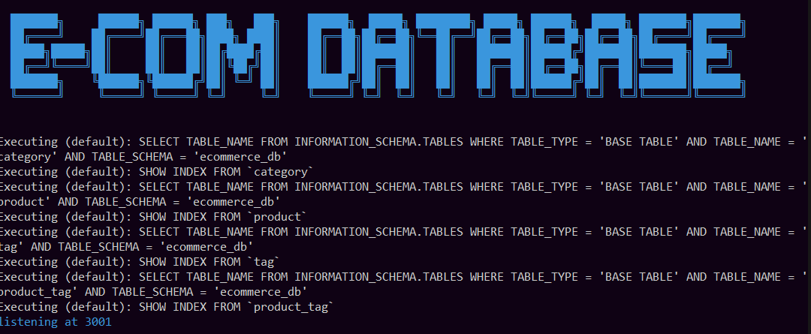

# E-commerce Back End

This project is the back end for an e-commerce site. It uses the latest technologies.

#### The back end is built using Express.js, and it is configured to use Sequelize to interact with a MySQL database. The database contains four models: Category, Product, Tag, and ProductTag. The models have associations set up, The application provides API routes to perform CRUD (Create, Read, Update, Delete) operations on the data.
---

---

---
## Installation

To run the application locally, follow these steps:

1. Clone the repository to your local machine.

2. Navigate to the project directory in the terminal.

3. Run `npm install` to install the dependencies.

4. Create a `.env` file in the root directory and add your MySQL username, password, and database name to secure your information.

## Usage

Once you have completed the installation, follow these steps to start the application:

1. Go into MySQL Shell and create the database.
2. Run `npm run seed` to seed the database with test data.
3. Run `npm start` to start the application's server.

## Walkthrough Video

To see the functionality of the e-commerce back end and to verify that all acceptance criteria have been met, watch the walkthrough video by clicking [here](https://clipchamp.com/watch/FUXauMYql8i)

## Technologies Used

- Express.js

- Sequelize (with MySQL2)

- dotenv

## License

This project was made by [Jacob Lowther](https://github.com/YggdrasilJL/).

---